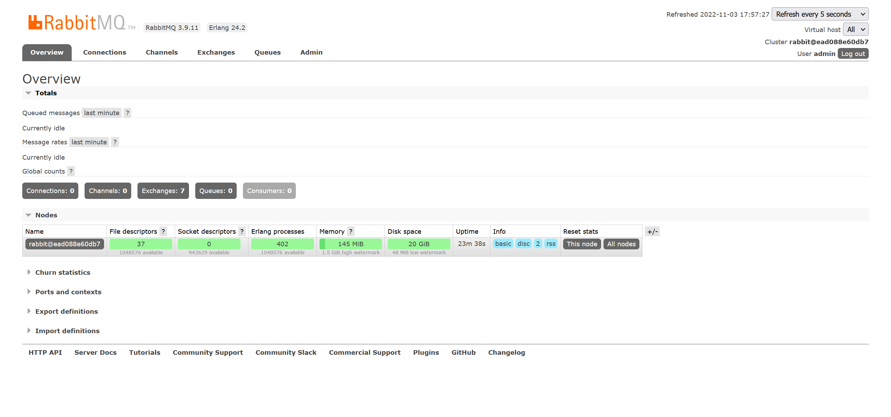

# RabbitMQ容器化部署
## 1. 下载镜像
```shell
docker pull rabbitmq:3.9-management
```

## 2. 创建持久化目录
```shell
mkdir -p /home/rabbitmq/data
```

## 3. 启动RabbitMQ容器
```shell
docker run --name rabbitmq -d -p 15672:15672 -p 5672:5672 -v /home/rabbitmq/data:/data -e RABBITMQ_DEFAULT_USER=admin -e RABBITMQ_DEFAULT_PASS=admin rabbitmq:3.9-management
```
- --name：指定容器名称
- -d：后台运行
- -p：将 mq 端口号映射到本地
- -v：将/home/rabbitmq/data挂载到容器中的/data目录
- -e RABBITMQ_DEFAULT_USER=admin：设置用户名为 admin
- -e RABBITMQ_DEFAULT_PASS=admin：设置密码为 admin

## 访问管理界面
通过访问`http://ip:15672`网址来访问管理界面，用户名和密码为容器启动时设置的内容


# SpringBoot集成RabbitMQ
## 1. 添加RabbitMQ依赖
```xml
<dependency>
    <groupId>org.springframework.boot</groupId>
    <artifactId>spring-boot-starter-amqp</artifactId>
</dependency>
```
## 2. 简单配置
```yml
spring:
  rabbitmq:
    host: 127.0.0.1 #ip
    port: 5672      #端口
    username: admin #账号
    password: admin #密码
```